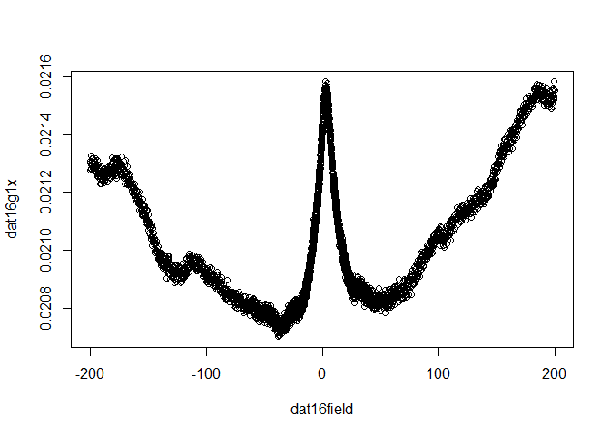
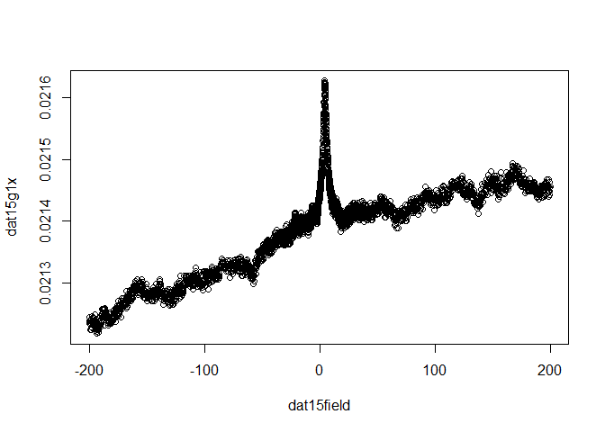
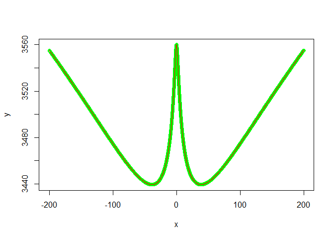
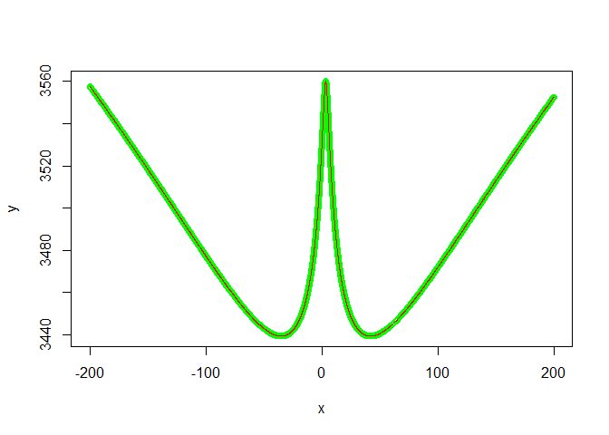
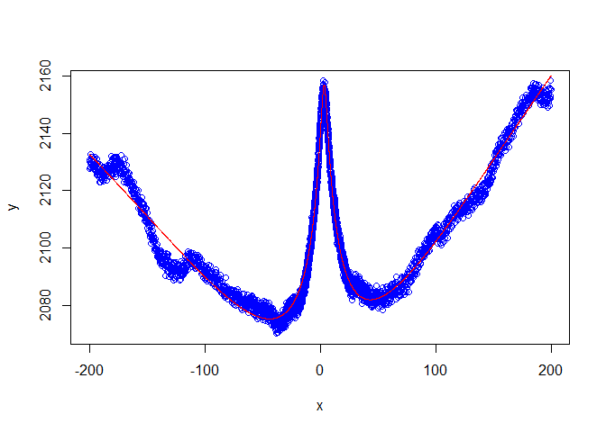

# Igor data read in R
Rui Yang  
September 20, 2016  


## Explore with tidyverse


```r
library(tidyverse)
```

```
## Loading tidyverse: ggplot2
## Loading tidyverse: tibble
## Loading tidyverse: tidyr
## Loading tidyverse: readr
## Loading tidyverse: purrr
## Loading tidyverse: dplyr
```

```
## Conflicts with tidy packages ----------------------------------------------
```

```
## filter(): dplyr, stats
## lag():    dplyr, stats
```

```r
library(IgorR)
```

## Now I will explore 


```r
#tt <- read.ibw("dat16g1x.ibw", Verbose = FALSE, ReturnTimeSeries = TRUE,
#MakeWave = FALSE, HeaderOnly = FALSE)
#plot(tt)
```


```r
t16 <- read.ibw("dat16g1x.ibw", Verbose = FALSE, ReturnTimeSeries = FALSE,
MakeWave = TRUE, HeaderOnly = FALSE)

read.ibw("dat15g1x.ibw", Verbose = FALSE, ReturnTimeSeries = FALSE,
MakeWave = TRUE, HeaderOnly = FALSE)

b16 <- read.ibw("dat16field.ibw", Verbose = FALSE, ReturnTimeSeries = FALSE,
MakeWave = TRUE, HeaderOnly = FALSE)

read.ibw("dat15field.ibw", Verbose = FALSE, ReturnTimeSeries = FALSE,
MakeWave = TRUE, HeaderOnly = FALSE)
```


```r
plot(dat16field,dat16g1x)
```

<!-- -->

```r
plot(dat15field,dat15g1x)
```

<!-- -->


```r
#f <- function(x, a, b) {
#     digamma(a*x+b)
#}
#x <- seq(1:100)
#y <- f(seq(1:100), 1,1)
#plot(x,y, geom="line")

#fit <- nls(y~f(x,a,b), data=data.frame(x,y), start=list(a=1, b=1))
```


```r
#x = seq(0,1,length=11)
# y =digamma(x+1)
 
# plot(x,y)
 # lm1 = lm(y~digamma(a*x+b),start=list(a=1,b=1))
 # summary(lm1)
```


```r
#dat16field,dat16g1x
#len <- 24
#x = runif(len)
#y = x^3 + runif(len, min = -0.1, max = 0.1)
#plot(x, y)
#s <- seq(from = 0, to = 1, length = 50)
#lines(s, s^3, lty = 2)

#df <- data.frame(x, y)
#m <- nls(y ~ I(x^power), data = df, start = list(power = 1), trace = T)
```


```r
#len <- 24
#x = runif(len)
#y = digamma(x+1) + runif(len, min = -0.1, max = 0.1)
#plot(x, y)

#s <- seq(from = 0, to = 1, length = 50)
#lines(s, digamma(s+1), lty = 2)

#df <- data.frame(x, y)
#m <- nls(y ~ digamma(a*x+b), data = df, start = list(a = 1,b=0.5), trace = T)


#yyy <- predict(m)

#lines(x,yyy)
```


```r
q <- 1.6e-19
h <- 6.63e-34
len <- 24
x =  dat16field
#tt=wlcorr(ff.y, 3.3877, 3560, 1, 1, 30, 0, 1)
lin <- 0
  ro <- 3560
  A <- 1
  Bphi <- 1
  Bi <- 1
  Bstar <- 30
  b0 <- 3.3877
  
y =  (lin*x) + ro - A*ro*ro*(q*q/pi/h*((log(abs(x)/abs(Bphi))+digamma(0.5+1/(abs(x)/abs(Bphi))))-(log(abs(x)/(abs(Bphi)+2*abs(Bi)))+digamma(0.5+1/(abs(x)/(abs(Bphi)+2*abs(Bi)))))-2*(log(abs(x)/(abs(Bphi)+abs(Bstar)))+digamma(0.5+1/(abs(x)/(abs(Bphi)+abs(Bstar))))))) 
plot(x, y,lty=2,col="green")


#s <- seq(from = 0, to = 1, length = 50)
#lines(s, digamma(s+1), lty = 2)

df <- data.frame(x, y)
m2 <- nls(y ~ (lin*x) + ro - A*ro*ro*(q*q/pi/h*((log(abs(x)/abs(Bphi))+digamma(0.5+1/(abs(x)/abs(Bphi))))-(log(abs(x)/(abs(Bphi)+2*abs(Bi)))+digamma(0.5+1/(abs(x)/(abs(Bphi)+2*abs(Bi)))))-2*(log(abs(x)/(abs(Bphi)+abs(Bstar)))+digamma(0.5+1/(abs(x)/(abs(Bphi)+abs(Bstar))))))), data = df, start = list(lin=0.1,ro=3560,A=1.2,Bphi=1.1,Bi=1.1,Bstar=28), trace = T,nls.control(maxiter = 500, tol = 1e-02, minFactor = 1/1024/2,
            printEval = FALSE, warnOnly = FALSE))
```

```
## 824300 :     0.1 3560.0    1.2    1.1    1.1   28.0
## 5623.535 :  -3.718693e-07  3.559921e+03  1.000589e+00  1.011919e+00  1.006608e+00  2.965802e+01
## 0.1181759 :  -4.555100e-08  3.559999e+03  9.999563e-01  9.998680e-01  9.999376e-01  2.999657e+01
## 3.946854e-08 :  -3.766765e-08  3.560000e+03  1.000000e+00  1.000000e+00  1.000000e+00  3.000000e+01
## 2.864814e-08 :  -3.226077e-08  3.560000e+03  1.000000e+00  1.000000e+00  1.000000e+00  3.000000e+01
## 2.214942e-08 :  -2.836665e-08  3.560000e+03  1.000000e+00  1.000000e+00  1.000000e+00  3.000000e+01
## 1.759151e-08 :  -2.527968e-08  3.560000e+03  1.000000e+00  1.000000e+00  1.000000e+00  3.000000e+01
## 1.436051e-08 :  -2.284085e-08  3.560000e+03  1.000000e+00  1.000000e+00  1.000000e+00  3.000000e+01
## 1.204548e-08 :  -2.091904e-08  3.560000e+03  1.000000e+00  1.000000e+00  1.000000e+00  3.000000e+01
## 1.00949e-08 :  -1.91503e-08  3.56000e+03  1.00000e+00  1.00000e+00  1.00000e+00  3.00000e+01
## 8.640342e-09 :  -1.771724e-08  3.560000e+03  1.000000e+00  1.000000e+00  1.000000e+00  3.000000e+01
## 7.56896e-09 :  -1.658154e-08  3.560000e+03  1.000000e+00  1.000000e+00  1.000000e+00  3.000000e+01
## 6.673071e-09 :  -1.556991e-08  3.560000e+03  1.000000e+00  1.000000e+00  1.000000e+00  3.000000e+01
## 5.903473e-09 :  -1.464465e-08  3.560000e+03  1.000000e+00  1.000000e+00  1.000000e+00  3.000000e+01
## 5.299103e-09 :  -1.387494e-08  3.560000e+03  1.000000e+00  1.000000e+00  1.000000e+00  3.000000e+01
## 4.733931e-09 :  -1.311419e-08  3.560000e+03  1.000000e+00  1.000000e+00  1.000000e+00  3.000000e+01
## 4.241261e-09 :  -1.241302e-08  3.560000e+03  1.000000e+00  1.000000e+00  1.000000e+00  3.000000e+01
## 3.842878e-09 :  -1.181563e-08  3.560000e+03  1.000000e+00  1.000000e+00  1.000000e+00  3.000000e+01
## 3.524859e-09 :  -1.131603e-08  3.560000e+03  1.000000e+00  1.000000e+00  1.000000e+00  3.000000e+01
## 3.218062e-09 :  -1.081254e-08  3.560000e+03  1.000000e+00  1.000000e+00  1.000000e+00  3.000000e+01
## 2.943414e-09 :  -1.034078e-08  3.560000e+03  1.000000e+00  1.000000e+00  1.000000e+00  3.000000e+01
## 2.702146e-09 :  -9.907707e-09  3.560000e+03  1.000000e+00  1.000000e+00  1.000000e+00  3.000000e+01
## 2.50267e-09 :  -9.535218e-09  3.560000e+03  1.000000e+00  1.000000e+00  1.000000e+00  3.000000e+01
## 2.338322e-09 :  -9.216717e-09  3.560000e+03  1.000000e+00  1.000000e+00  1.000000e+00  3.000000e+01
## 2.173857e-09 :  -8.886519e-09  3.560000e+03  1.000000e+00  1.000000e+00  1.000000e+00  3.000000e+01
## 2.021745e-09 :  -8.569581e-09  3.560000e+03  1.000000e+00  1.000000e+00  1.000000e+00  3.000000e+01
## 1.898646e-09 :  -8.30521e-09  3.56000e+03  1.00000e+00  1.00000e+00  1.00000e+00  3.00000e+01
## 1.776045e-09 :  -8.032577e-09  3.560000e+03  1.000000e+00  1.000000e+00  1.000000e+00  3.000000e+01
## 1.673183e-09 :  -7.796489e-09  3.560000e+03  1.000000e+00  1.000000e+00  1.000000e+00  3.000000e+01
## 1.590521e-09 :  -7.601506e-09  3.560000e+03  1.000000e+00  1.000000e+00  1.000000e+00  3.000000e+01
## 1.50371e-09 :  -7.391102e-09  3.560000e+03  1.000000e+00  1.000000e+00  1.000000e+00  3.000000e+01
## 1.429189e-09 :  -7.205652e-09  3.560000e+03  1.000000e+00  1.000000e+00  1.000000e+00  3.000000e+01
## 1.344356e-09 :  -6.988541e-09  3.560000e+03  1.000000e+00  1.000000e+00  1.000000e+00  3.000000e+01
## 1.272406e-09 :  -6.798964e-09  3.560000e+03  1.000000e+00  1.000000e+00  1.000000e+00  3.000000e+01
## 1.207539e-09 :  -6.623386e-09  3.560000e+03  1.000000e+00  1.000000e+00  1.000000e+00  3.000000e+01
## 1.146409e-09 :  -6.453561e-09  3.560000e+03  1.000000e+00  1.000000e+00  1.000000e+00  3.000000e+01
## 1.087139e-09 :  -6.284475e-09  3.560000e+03  1.000000e+00  1.000000e+00  1.000000e+00  3.000000e+01
## 1.0383e-09 :  -6.141693e-09  3.560000e+03  1.000000e+00  1.000000e+00  1.000000e+00  3.000000e+01
## 9.906977e-10 :  -5.99931e-09  3.56000e+03  1.00000e+00  1.00000e+00  1.00000e+00  3.00000e+01
## 9.479069e-10 :  -5.86825e-09  3.56000e+03  1.00000e+00  1.00000e+00  1.00000e+00  3.00000e+01
## 9.085921e-10 :  -5.745313e-09  3.560000e+03  1.000000e+00  1.000000e+00  1.000000e+00  3.000000e+01
## 8.676268e-10 :  -5.614279e-09  3.560000e+03  1.000000e+00  1.000000e+00  1.000000e+00  3.000000e+01
## 8.316857e-10 :  -5.496792e-09  3.560000e+03  1.000000e+00  1.000000e+00  1.000000e+00  3.000000e+01
## 7.953636e-10 :  -5.375409e-09  3.560000e+03  1.000000e+00  1.000000e+00  1.000000e+00  3.000000e+01
## 7.611275e-10 :  -5.258433e-09  3.560000e+03  1.000000e+00  1.000000e+00  1.000000e+00  3.000000e+01
## 7.315448e-10 :  -5.155241e-09  3.560000e+03  1.000000e+00  1.000000e+00  1.000000e+00  3.000000e+01
## 7.040901e-10 :  -5.057597e-09  3.560000e+03  1.000000e+00  1.000000e+00  1.000000e+00  3.000000e+01
## 6.76082e-10 :  -4.955993e-09  3.560000e+03  1.000000e+00  1.000000e+00  1.000000e+00  3.000000e+01
## 6.518239e-10 :  -4.866264e-09  3.560000e+03  1.000000e+00  1.000000e+00  1.000000e+00  3.000000e+01
## 6.260878e-10 :  -4.769226e-09  3.560000e+03  1.000000e+00  1.000000e+00  1.000000e+00  3.000000e+01
## 6.044315e-10 :  -4.685967e-09  3.560000e+03  1.000000e+00  1.000000e+00  1.000000e+00  3.000000e+01
## 5.859568e-10 :  -4.613853e-09  3.560000e+03  1.000000e+00  1.000000e+00  1.000000e+00  3.000000e+01
## 5.649039e-10 :  -4.530192e-09  3.560000e+03  1.000000e+00  1.000000e+00  1.000000e+00  3.000000e+01
## 5.467002e-10 :  -4.456592e-09  3.560000e+03  1.000000e+00  1.000000e+00  1.000000e+00  3.000000e+01
## 5.388291e-10 :  -4.424423e-09  3.560000e+03  1.000000e+00  1.000000e+00  1.000000e+00  3.000000e+01
## 5.21491e-10 :  -4.352544e-09  3.560000e+03  1.000000e+00  1.000000e+00  1.000000e+00  3.000000e+01
## 5.037723e-10 :  -4.278056e-09  3.560000e+03  1.000000e+00  1.000000e+00  1.000000e+00  3.000000e+01
## 4.851848e-10 :  -4.198409e-09  3.560000e+03  1.000000e+00  1.000000e+00  1.000000e+00  3.000000e+01
## 4.705407e-10 :  -4.134557e-09  3.560000e+03  1.000000e+00  1.000000e+00  1.000000e+00  3.000000e+01
## 4.56677e-10 :  -4.073197e-09  3.560000e+03  1.000000e+00  1.000000e+00  1.000000e+00  3.000000e+01
## 4.418439e-10 :  -4.006502e-09  3.560000e+03  1.000000e+00  1.000000e+00  1.000000e+00  3.000000e+01
## 4.267201e-10 :  -3.937337e-09  3.560000e+03  1.000000e+00  1.000000e+00  1.000000e+00  3.000000e+01
## 4.140755e-10 :  -3.878563e-09  3.560000e+03  1.000000e+00  1.000000e+00  1.000000e+00  3.000000e+01
## 4.013869e-10 :  -3.818611e-09  3.560000e+03  1.000000e+00  1.000000e+00  1.000000e+00  3.000000e+01
## 3.894487e-10 :  -3.761447e-09  3.560000e+03  1.000000e+00  1.000000e+00  1.000000e+00  3.000000e+01
## 3.773043e-10 :  -3.702336e-09  3.560000e+03  1.000000e+00  1.000000e+00  1.000000e+00  3.000000e+01
## 3.672379e-10 :  -3.652571e-09  3.560000e+03  1.000000e+00  1.000000e+00  1.000000e+00  3.000000e+01
## 3.578129e-10 :  -3.605439e-09  3.560000e+03  1.000000e+00  1.000000e+00  1.000000e+00  3.000000e+01
## 3.488471e-10 :  -3.559971e-09  3.560000e+03  1.000000e+00  1.000000e+00  1.000000e+00  3.000000e+01
## 3.398739e-10 :  -3.513898e-09  3.560000e+03  1.000000e+00  1.000000e+00  1.000000e+00  3.000000e+01
## 3.302379e-10 :  -3.463732e-09  3.560000e+03  1.000000e+00  1.000000e+00  1.000000e+00  3.000000e+01
## 3.231932e-10 :  -3.426586e-09  3.560000e+03  1.000000e+00  1.000000e+00  1.000000e+00  3.000000e+01
## 3.147477e-10 :  -3.381514e-09  3.560000e+03  1.000000e+00  1.000000e+00  1.000000e+00  3.000000e+01
## 3.055836e-10 :  -3.331918e-09  3.560000e+03  1.000000e+00  1.000000e+00  1.000000e+00  3.000000e+01
## 2.976376e-10 :  -3.288313e-09  3.560000e+03  1.000000e+00  1.000000e+00  1.000000e+00  3.000000e+01
## 2.900954e-10 :  -3.246379e-09  3.560000e+03  1.000000e+00  1.000000e+00  1.000000e+00  3.000000e+01
## 2.83783e-10 :  -3.210865e-09  3.560000e+03  1.000000e+00  1.000000e+00  1.000000e+00  3.000000e+01
## 2.778131e-10 :  -3.176926e-09  3.560000e+03  1.000000e+00  1.000000e+00  1.000000e+00  3.000000e+01
## 2.715371e-10 :  -3.140817e-09  3.560000e+03  1.000000e+00  1.000000e+00  1.000000e+00  3.000000e+01
## 2.648448e-10 :  -3.101886e-09  3.560000e+03  1.000000e+00  1.000000e+00  1.000000e+00  3.000000e+01
## 2.593389e-10 :  -3.069459e-09  3.560000e+03  1.000000e+00  1.000000e+00  1.000000e+00  3.000000e+01
## 2.523422e-10 :  -3.027789e-09  3.560000e+03  1.000000e+00  1.000000e+00  1.000000e+00  3.000000e+01
## 2.463317e-10 :  -2.991443e-09  3.560000e+03  1.000000e+00  1.000000e+00  1.000000e+00  3.000000e+01
## 2.407934e-10 :  -2.957684e-09  3.560000e+03  1.000000e+00  1.000000e+00  1.000000e+00  3.000000e+01
## 2.353194e-10 :  -2.923881e-09  3.560000e+03  1.000000e+00  1.000000e+00  1.000000e+00  3.000000e+01
## 2.298646e-10 :  -2.889289e-09  3.560000e+03  1.000000e+00  1.000000e+00  1.000000e+00  3.000000e+01
## 2.250055e-10 :  -2.859088e-09  3.560000e+03  1.000000e+00  1.000000e+00  1.000000e+00  3.000000e+01
## 2.203095e-10 :  -2.829081e-09  3.560000e+03  1.000000e+00  1.000000e+00  1.000000e+00  3.000000e+01
## 2.152076e-10 :  -2.796141e-09  3.560000e+03  1.000000e+00  1.000000e+00  1.000000e+00  3.000000e+01
## 2.100954e-10 :  -2.762733e-09  3.560000e+03  1.000000e+00  1.000000e+00  1.000000e+00  3.000000e+01
## 2.054091e-10 :  -2.731747e-09  3.560000e+03  1.000000e+00  1.000000e+00  1.000000e+00  3.000000e+01
## 2.008703e-10 :  -2.701364e-09  3.560000e+03  1.000000e+00  1.000000e+00  1.000000e+00  3.000000e+01
## 1.969525e-10 :  -2.674911e-09  3.560000e+03  1.000000e+00  1.000000e+00  1.000000e+00  3.000000e+01
## 1.933128e-10 :  -2.650093e-09  3.560000e+03  1.000000e+00  1.000000e+00  1.000000e+00  3.000000e+01
## 1.895246e-10 :  -2.623995e-09  3.560000e+03  1.000000e+00  1.000000e+00  1.000000e+00  3.000000e+01
## 1.85156e-10 :  -2.593575e-09  3.560000e+03  1.000000e+00  1.000000e+00  1.000000e+00  3.000000e+01
## 1.81724e-10 :  -2.569412e-09  3.560000e+03  1.000000e+00  1.000000e+00  1.000000e+00  3.000000e+01
## 1.78256e-10 :  -2.544783e-09  3.560000e+03  1.000000e+00  1.000000e+00  1.000000e+00  3.000000e+01
## 1.747286e-10 :  -2.519484e-09  3.560000e+03  1.000000e+00  1.000000e+00  1.000000e+00  3.000000e+01
## 1.717307e-10 :  -2.497753e-09  3.560000e+03  1.000000e+00  1.000000e+00  1.000000e+00  3.000000e+01
## 1.690272e-10 :  -2.478037e-09  3.560000e+03  1.000000e+00  1.000000e+00  1.000000e+00  3.000000e+01
## 1.660128e-10 :  -2.455843e-09  3.560000e+03  1.000000e+00  1.000000e+00  1.000000e+00  3.000000e+01
## 1.630267e-10 :  -2.433644e-09  3.560000e+03  1.000000e+00  1.000000e+00  1.000000e+00  3.000000e+01
## 1.595086e-10 :  -2.407256e-09  3.560000e+03  1.000000e+00  1.000000e+00  1.000000e+00  3.000000e+01
## 1.556992e-10 :  -2.378336e-09  3.560000e+03  1.000000e+00  1.000000e+00  1.000000e+00  3.000000e+01
## 1.528135e-10 :  -2.356197e-09  3.560000e+03  1.000000e+00  1.000000e+00  1.000000e+00  3.000000e+01
## 1.498385e-10 :  -2.33313e-09  3.56000e+03  1.00000e+00  1.00000e+00  1.00000e+00  3.00000e+01
## 1.472228e-10 :  -2.312692e-09  3.560000e+03  1.000000e+00  1.000000e+00  1.000000e+00  3.000000e+01
## 1.444411e-10 :  -2.290742e-09  3.560000e+03  1.000000e+00  1.000000e+00  1.000000e+00  3.000000e+01
## 1.41821e-10 :  -2.269868e-09  3.560000e+03  1.000000e+00  1.000000e+00  1.000000e+00  3.000000e+01
## 1.391611e-10 :  -2.248464e-09  3.560000e+03  1.000000e+00  1.000000e+00  1.000000e+00  3.000000e+01
## 1.362415e-10 :  -2.22477e-09  3.56000e+03  1.00000e+00  1.00000e+00  1.00000e+00  3.00000e+01
## 1.339372e-10 :  -2.205875e-09  3.560000e+03  1.000000e+00  1.000000e+00  1.000000e+00  3.000000e+01
## 1.318177e-10 :  -2.188351e-09  3.560000e+03  1.000000e+00  1.000000e+00  1.000000e+00  3.000000e+01
## 1.295152e-10 :  -2.169155e-09  3.560000e+03  1.000000e+00  1.000000e+00  1.000000e+00  3.000000e+01
## 1.273778e-10 :  -2.15118e-09  3.56000e+03  1.00000e+00  1.00000e+00  1.00000e+00  3.00000e+01
## 1.253975e-10 :  -2.134389e-09  3.560000e+03  1.000000e+00  1.000000e+00  1.000000e+00  3.000000e+01
## 1.233858e-10 :  -2.117171e-09  3.560000e+03  1.000000e+00  1.000000e+00  1.000000e+00  3.000000e+01
## 1.216399e-10 :  -2.102172e-09  3.560000e+03  1.000000e+00  1.000000e+00  1.000000e+00  3.000000e+01
## 1.196903e-10 :  -2.085252e-09  3.560000e+03  1.000000e+00  1.000000e+00  1.000000e+00  3.000000e+01
## 1.18006e-10 :  -2.070532e-09  3.560000e+03  1.000000e+00  1.000000e+00  1.000000e+00  3.000000e+01
## 1.162561e-10 :  -2.055126e-09  3.560000e+03  1.000000e+00  1.000000e+00  1.000000e+00  3.000000e+01
## 1.146455e-10 :  -2.040841e-09  3.560000e+03  1.000000e+00  1.000000e+00  1.000000e+00  3.000000e+01
## 1.130795e-10 :  -2.026855e-09  3.560000e+03  1.000000e+00  1.000000e+00  1.000000e+00  3.000000e+01
## 1.112534e-10 :  -2.010418e-09  3.560000e+03  1.000000e+00  1.000000e+00  1.000000e+00  3.000000e+01
## 1.095644e-10 :  -1.995095e-09  3.560000e+03  1.000000e+00  1.000000e+00  1.000000e+00  3.000000e+01
## 1.083139e-10 :  -1.983667e-09  3.560000e+03  1.000000e+00  1.000000e+00  1.000000e+00  3.000000e+01
## 1.06836e-10 :  -1.970106e-09  3.560000e+03  1.000000e+00  1.000000e+00  1.000000e+00  3.000000e+01
## 1.050078e-10 :  -1.953177e-09  3.560000e+03  1.000000e+00  1.000000e+00  1.000000e+00  3.000000e+01
## 1.032265e-10 :  -1.936538e-09  3.560000e+03  1.000000e+00  1.000000e+00  1.000000e+00  3.000000e+01
## 1.017758e-10 :  -1.922876e-09  3.560000e+03  1.000000e+00  1.000000e+00  1.000000e+00  3.000000e+01
## 1.002298e-10 :  -1.908219e-09  3.560000e+03  1.000000e+00  1.000000e+00  1.000000e+00  3.000000e+01
## 9.845782e-11 :  -1.891229e-09  3.560000e+03  1.000000e+00  1.000000e+00  1.000000e+00  3.000000e+01
## 9.709181e-11 :  -1.878111e-09  3.560000e+03  1.000000e+00  1.000000e+00  1.000000e+00  3.000000e+01
## 9.547377e-11 :  -1.862399e-09  3.560000e+03  1.000000e+00  1.000000e+00  1.000000e+00  3.000000e+01
## 9.416207e-11 :  -1.84956e-09  3.56000e+03  1.00000e+00  1.00000e+00  1.00000e+00  3.00000e+01
## 9.297289e-11 :  -1.837843e-09  3.560000e+03  1.000000e+00  1.000000e+00  1.000000e+00  3.000000e+01
## 9.15596e-11 :  -1.82382e-09  3.56000e+03  1.00000e+00  1.00000e+00  1.00000e+00  3.00000e+01
## 9.044242e-11 :  -1.812663e-09  3.560000e+03  1.000000e+00  1.000000e+00  1.000000e+00  3.000000e+01
## 8.92374e-11 :  -1.800545e-09  3.560000e+03  1.000000e+00  1.000000e+00  1.000000e+00  3.000000e+01
## 8.818325e-11 :  -1.789875e-09  3.560000e+03  1.000000e+00  1.000000e+00  1.000000e+00  3.000000e+01
## 8.694327e-11 :  -1.777249e-09  3.560000e+03  1.000000e+00  1.000000e+00  1.000000e+00  3.000000e+01
## 8.582377e-11 :  -1.765769e-09  3.560000e+03  1.000000e+00  1.000000e+00  1.000000e+00  3.000000e+01
## 8.451336e-11 :  -1.752234e-09  3.560000e+03  1.000000e+00  1.000000e+00  1.000000e+00  3.000000e+01
## 8.317023e-11 :  -1.738259e-09  3.560000e+03  1.000000e+00  1.000000e+00  1.000000e+00  3.000000e+01
## 8.193352e-11 :  -1.725214e-09  3.560000e+03  1.000000e+00  1.000000e+00  1.000000e+00  3.000000e+01
## 8.094671e-11 :  -1.714835e-09  3.560000e+03  1.000000e+00  1.000000e+00  1.000000e+00  3.000000e+01
## 7.998877e-11 :  -1.704688e-09  3.560000e+03  1.000000e+00  1.000000e+00  1.000000e+00  3.000000e+01
## 7.906262e-11 :  -1.694782e-09  3.560000e+03  1.000000e+00  1.000000e+00  1.000000e+00  3.000000e+01
## 7.81104e-11 :  -1.684555e-09  3.560000e+03  1.000000e+00  1.000000e+00  1.000000e+00  3.000000e+01
## 7.719045e-11 :  -1.674599e-09  3.560000e+03  1.000000e+00  1.000000e+00  1.000000e+00  3.000000e+01
## 7.615253e-11 :  -1.663308e-09  3.560000e+03  1.000000e+00  1.000000e+00  1.000000e+00  3.000000e+01
## 7.486447e-11 :  -1.649171e-09  3.560000e+03  1.000000e+00  1.000000e+00  1.000000e+00  3.000000e+01
## 7.370867e-11 :  -1.636401e-09  3.560000e+03  1.000000e+00  1.000000e+00  1.000000e+00  3.000000e+01
## 7.27907e-11 :  -1.626179e-09  3.560000e+03  1.000000e+00  1.000000e+00  1.000000e+00  3.000000e+01
## 7.199875e-11 :  -1.617307e-09  3.560000e+03  1.000000e+00  1.000000e+00  1.000000e+00  3.000000e+01
## 7.111316e-11 :  -1.607333e-09  3.560000e+03  1.000000e+00  1.000000e+00  1.000000e+00  3.000000e+01
## 7.039774e-11 :  -1.599226e-09  3.560000e+03  1.000000e+00  1.000000e+00  1.000000e+00  3.000000e+01
## 6.946043e-11 :  -1.588542e-09  3.560000e+03  1.000000e+00  1.000000e+00  1.000000e+00  3.000000e+01
## 6.865808e-11 :  -1.579344e-09  3.560000e+03  1.000000e+00  1.000000e+00  1.000000e+00  3.000000e+01
## 6.774676e-11 :  -1.568819e-09  3.560000e+03  1.000000e+00  1.000000e+00  1.000000e+00  3.000000e+01
## 6.695804e-11 :  -1.559665e-09  3.560000e+03  1.000000e+00  1.000000e+00  1.000000e+00  3.000000e+01
## 6.656318e-11 :  -1.555063e-09  3.560000e+03  1.000000e+00  1.000000e+00  1.000000e+00  3.000000e+01
## 6.570504e-11 :  -1.545005e-09  3.560000e+03  1.000000e+00  1.000000e+00  1.000000e+00  3.000000e+01
## 6.505431e-11 :  -1.537336e-09  3.560000e+03  1.000000e+00  1.000000e+00  1.000000e+00  3.000000e+01
## 6.417558e-11 :  -1.526907e-09  3.560000e+03  1.000000e+00  1.000000e+00  1.000000e+00  3.000000e+01
## 6.371954e-11 :  -1.521484e-09  3.560000e+03  1.000000e+00  1.000000e+00  1.000000e+00  3.000000e+01
## 6.297627e-11 :  -1.512584e-09  3.560000e+03  1.000000e+00  1.000000e+00  1.000000e+00  3.000000e+01
## 6.235684e-11 :  -1.505124e-09  3.560000e+03  1.000000e+00  1.000000e+00  1.000000e+00  3.000000e+01
## 6.173639e-11 :  -1.497615e-09  3.560000e+03  1.000000e+00  1.000000e+00  1.000000e+00  3.000000e+01
## 6.117956e-11 :  -1.49085e-09  3.56000e+03  1.00000e+00  1.00000e+00  1.00000e+00  3.00000e+01
## 6.065198e-11 :  -1.484408e-09  3.560000e+03  1.000000e+00  1.000000e+00  1.000000e+00  3.000000e+01
## 5.992954e-11 :  -1.475541e-09  3.560000e+03  1.000000e+00  1.000000e+00  1.000000e+00  3.000000e+01
## 5.913046e-11 :  -1.465667e-09  3.560000e+03  1.000000e+00  1.000000e+00  1.000000e+00  3.000000e+01
## 5.841028e-11 :  -1.456717e-09  3.560000e+03  1.000000e+00  1.000000e+00  1.000000e+00  3.000000e+01
## 5.77473e-11 :  -1.448426e-09  3.560000e+03  1.000000e+00  1.000000e+00  1.000000e+00  3.000000e+01
## 5.722848e-11 :  -1.441906e-09  3.560000e+03  1.000000e+00  1.000000e+00  1.000000e+00  3.000000e+01
## 5.659096e-11 :  -1.433852e-09  3.560000e+03  1.000000e+00  1.000000e+00  1.000000e+00  3.000000e+01
## 5.602577e-11 :  -1.426673e-09  3.560000e+03  1.000000e+00  1.000000e+00  1.000000e+00  3.000000e+01
## 5.528876e-11 :  -1.417255e-09  3.560000e+03  1.000000e+00  1.000000e+00  1.000000e+00  3.000000e+01
## 5.471626e-11 :  -1.409902e-09  3.560000e+03  1.000000e+00  1.000000e+00  1.000000e+00  3.000000e+01
## 5.398737e-11 :  -1.40048e-09  3.56000e+03  1.00000e+00  1.00000e+00  1.00000e+00  3.00000e+01
## 5.3422e-11 :  -1.393127e-09  3.560000e+03  1.000000e+00  1.000000e+00  1.000000e+00  3.000000e+01
## 5.269354e-11 :  -1.383597e-09  3.560000e+03  1.000000e+00  1.000000e+00  1.000000e+00  3.000000e+01
## 5.216678e-11 :  -1.376661e-09  3.560000e+03  1.000000e+00  1.000000e+00  1.000000e+00  3.000000e+01
## 5.160937e-11 :  -1.369288e-09  3.560000e+03  1.000000e+00  1.000000e+00  1.000000e+00  3.000000e+01
## 5.103009e-11 :  -1.361577e-09  3.560000e+03  1.000000e+00  1.000000e+00  1.000000e+00  3.000000e+01
## 5.066037e-11 :  -1.356638e-09  3.560000e+03  1.000000e+00  1.000000e+00  1.000000e+00  3.000000e+01
## 5.017839e-11 :  -1.350173e-09  3.560000e+03  1.000000e+00  1.000000e+00  1.000000e+00  3.000000e+01
## 4.948165e-11 :  -1.340765e-09  3.560000e+03  1.000000e+00  1.000000e+00  1.000000e+00  3.000000e+01
## 4.885879e-11 :  -1.332296e-09  3.560000e+03  1.000000e+00  1.000000e+00  1.000000e+00  3.000000e+01
## 4.828821e-11 :  -1.324497e-09  3.560000e+03  1.000000e+00  1.000000e+00  1.000000e+00  3.000000e+01
## 4.770687e-11 :  -1.316502e-09  3.560000e+03  1.000000e+00  1.000000e+00  1.000000e+00  3.000000e+01
## 4.722607e-11 :  -1.309848e-09  3.560000e+03  1.000000e+00  1.000000e+00  1.000000e+00  3.000000e+01
## 4.679622e-11 :  -1.303876e-09  3.560000e+03  1.000000e+00  1.000000e+00  1.000000e+00  3.000000e+01
## 4.632738e-11 :  -1.297323e-09  3.560000e+03  1.000000e+00  1.000000e+00  1.000000e+00  3.000000e+01
## 4.600976e-11 :  -1.292871e-09  3.560000e+03  1.000000e+00  1.000000e+00  1.000000e+00  3.000000e+01
## 4.540811e-11 :  -1.284387e-09  3.560000e+03  1.000000e+00  1.000000e+00  1.000000e+00  3.000000e+01
## 4.482167e-11 :  -1.276071e-09  3.560000e+03  1.000000e+00  1.000000e+00  1.000000e+00  3.000000e+01
## 4.440437e-11 :  -1.270117e-09  3.560000e+03  1.000000e+00  1.000000e+00  1.000000e+00  3.000000e+01
## 4.397426e-11 :  -1.263951e-09  3.560000e+03  1.000000e+00  1.000000e+00  1.000000e+00  3.000000e+01
## 4.355877e-11 :  -1.257965e-09  3.560000e+03  1.000000e+00  1.000000e+00  1.000000e+00  3.000000e+01
## 4.30459e-11 :  -1.250433e-09  3.560000e+03  1.000000e+00  1.000000e+00  1.000000e+00  3.000000e+01
## 4.271672e-11 :  -1.245747e-09  3.560000e+03  1.000000e+00  1.000000e+00  1.000000e+00  3.000000e+01
## 4.236493e-11 :  -1.240606e-09  3.560000e+03  1.000000e+00  1.000000e+00  1.000000e+00  3.000000e+01
## 4.201153e-11 :  -1.23542e-09  3.56000e+03  1.00000e+00  1.00000e+00  1.00000e+00  3.00000e+01
## 4.146802e-11 :  -1.227402e-09  3.560000e+03  1.000000e+00  1.000000e+00  1.000000e+00  3.000000e+01
## 4.100131e-11 :  -1.220474e-09  3.560000e+03  1.000000e+00  1.000000e+00  1.000000e+00  3.000000e+01
## 4.060004e-11 :  -1.21449e-09  3.56000e+03  1.00000e+00  1.00000e+00  1.00000e+00  3.00000e+01
## 4.032153e-11 :  -1.210314e-09  3.560000e+03  1.000000e+00  1.000000e+00  1.000000e+00  3.000000e+01
## 4.009628e-11 :  -1.206932e-09  3.560000e+03  1.000000e+00  1.000000e+00  1.000000e+00  3.000000e+01
## 3.958984e-11 :  -1.199278e-09  3.560000e+03  1.000000e+00  1.000000e+00  1.000000e+00  3.000000e+01
## 3.908324e-11 :  -1.191528e-09  3.560000e+03  1.000000e+00  1.000000e+00  1.000000e+00  3.000000e+01
## 3.867173e-11 :  -1.185288e-09  3.560000e+03  1.000000e+00  1.000000e+00  1.000000e+00  3.000000e+01
## 3.834358e-11 :  -1.180257e-09  3.560000e+03  1.000000e+00  1.000000e+00  1.000000e+00  3.000000e+01
## 3.801325e-11 :  -1.175164e-09  3.560000e+03  1.000000e+00  1.000000e+00  1.000000e+00  3.000000e+01
## 3.773152e-11 :  -1.170801e-09  3.560000e+03  1.000000e+00  1.000000e+00  1.000000e+00  3.000000e+01
## 3.727111e-11 :  -1.163636e-09  3.560000e+03  1.000000e+00  1.000000e+00  1.000000e+00  3.000000e+01
## 3.694324e-11 :  -1.158504e-09  3.560000e+03  1.000000e+00  1.000000e+00  1.000000e+00  3.000000e+01
## 3.658909e-11 :  -1.15294e-09  3.56000e+03  1.00000e+00  1.00000e+00  1.00000e+00  3.00000e+01
## 3.628632e-11 :  -1.148159e-09  3.560000e+03  1.000000e+00  1.000000e+00  1.000000e+00  3.000000e+01
## 3.592921e-11 :  -1.142494e-09  3.560000e+03  1.000000e+00  1.000000e+00  1.000000e+00  3.000000e+01
## 3.56372e-11 :  -1.137843e-09  3.560000e+03  1.000000e+00  1.000000e+00  1.000000e+00  3.000000e+01
## 3.551186e-11 :  -1.135842e-09  3.560000e+03  1.000000e+00  1.000000e+00  1.000000e+00  3.000000e+01
## 3.513929e-11 :  -1.129864e-09  3.560000e+03  1.000000e+00  1.000000e+00  1.000000e+00  3.000000e+01
## 3.469867e-11 :  -1.12276e-09  3.56000e+03  1.00000e+00  1.00000e+00  1.00000e+00  3.00000e+01
## 3.430807e-11 :  -1.116422e-09  3.560000e+03  1.000000e+00  1.000000e+00  1.000000e+00  3.000000e+01
## 3.414548e-11 :  -1.113775e-09  3.560000e+03  1.000000e+00  1.000000e+00  1.000000e+00  3.000000e+01
## 3.374972e-11 :  -1.107302e-09  3.560000e+03  1.000000e+00  1.000000e+00  1.000000e+00  3.000000e+01
## 3.347622e-11 :  -1.102805e-09  3.560000e+03  1.000000e+00  1.000000e+00  1.000000e+00  3.000000e+01
## 3.319699e-11 :  -1.098197e-09  3.560000e+03  1.000000e+00  1.000000e+00  1.000000e+00  3.000000e+01
## 3.28699e-11 :  -1.092768e-09  3.560000e+03  1.000000e+00  1.000000e+00  1.000000e+00  3.000000e+01
## 3.255043e-11 :  -1.087449e-09  3.560000e+03  1.000000e+00  1.000000e+00  1.000000e+00  3.000000e+01
## 3.229925e-11 :  -1.083246e-09  3.560000e+03  1.000000e+00  1.000000e+00  1.000000e+00  3.000000e+01
## 3.198411e-11 :  -1.077948e-09  3.560000e+03  1.000000e+00  1.000000e+00  1.000000e+00  3.000000e+01
## 3.177493e-11 :  -1.074417e-09  3.560000e+03  1.000000e+00  1.000000e+00  1.000000e+00  3.000000e+01
## 3.163909e-11 :  -1.072119e-09  3.560000e+03  1.000000e+00  1.000000e+00  1.000000e+00  3.000000e+01
## 3.13701e-11 :  -1.067551e-09  3.560000e+03  1.000000e+00  1.000000e+00  1.000000e+00  3.000000e+01
## 3.107102e-11 :  -1.062445e-09  3.560000e+03  1.000000e+00  1.000000e+00  1.000000e+00  3.000000e+01
## 3.082996e-11 :  -1.05832e-09  3.56000e+03  1.00000e+00  1.00000e+00  1.00000e+00  3.00000e+01
## 3.057383e-11 :  -1.053915e-09  3.560000e+03  1.000000e+00  1.000000e+00  1.000000e+00  3.000000e+01
## 3.029291e-11 :  -1.049037e-09  3.560000e+03  1.000000e+00  1.000000e+00  1.000000e+00  3.000000e+01
## 3.004862e-11 :  -1.044824e-09  3.560000e+03  1.000000e+00  1.000000e+00  1.000000e+00  3.000000e+01
## 2.9752e-11 :  -1.039654e-09  3.560000e+03  1.000000e+00  1.000000e+00  1.000000e+00  3.000000e+01
## 2.950731e-11 :  -1.03537e-09  3.56000e+03  1.00000e+00  1.00000e+00  1.00000e+00  3.00000e+01
## 2.931179e-11 :  -1.031934e-09  3.560000e+03  1.000000e+00  1.000000e+00  1.000000e+00  3.000000e+01
## 2.906516e-11 :  -1.027574e-09  3.560000e+03  1.000000e+00  1.000000e+00  1.000000e+00  3.000000e+01
## 2.882248e-11 :  -1.023284e-09  3.560000e+03  1.000000e+00  1.000000e+00  1.000000e+00  3.000000e+01
## 2.855873e-11 :  -1.018591e-09  3.560000e+03  1.000000e+00  1.000000e+00  1.000000e+00  3.000000e+01
## 2.836362e-11 :  -1.015105e-09  3.560000e+03  1.000000e+00  1.000000e+00  1.000000e+00  3.000000e+01
## 2.807332e-11 :  -1.009895e-09  3.560000e+03  1.000000e+00  1.000000e+00  1.000000e+00  3.000000e+01
## 2.77676e-11 :  -1.004381e-09  3.560000e+03  1.000000e+00  1.000000e+00  1.000000e+00  3.000000e+01
## 2.757357e-11 :  -1.000867e-09  3.560000e+03  1.000000e+00  1.000000e+00  1.000000e+00  3.000000e+01
## 2.738279e-11 :  -9.974003e-10  3.560000e+03  1.000000e+00  1.000000e+00  1.000000e+00  3.000000e+01
## 2.720257e-11 :  -9.941128e-10  3.560000e+03  1.000000e+00  1.000000e+00  1.000000e+00  3.000000e+01
## 2.701895e-11 :  -9.907505e-10  3.560000e+03  1.000000e+00  1.000000e+00  1.000000e+00  3.000000e+01
## 2.682551e-11 :  -9.871997e-10  3.560000e+03  1.000000e+00  1.000000e+00  1.000000e+00  3.000000e+01
## 2.661636e-11 :  -9.833429e-10  3.560000e+03  1.000000e+00  1.000000e+00  1.000000e+00  3.000000e+01
## 2.640035e-11 :  -9.793365e-10  3.560000e+03  1.000000e+00  1.000000e+00  1.000000e+00  3.000000e+01
## 2.61722e-11 :  -9.751018e-10  3.560000e+03  1.000000e+00  1.000000e+00  1.000000e+00  3.000000e+01
## 2.600992e-11 :  -9.720763e-10  3.560000e+03  1.000000e+00  1.000000e+00  1.000000e+00  3.000000e+01
## 2.579363e-11 :  -9.680216e-10  3.560000e+03  1.000000e+00  1.000000e+00  1.000000e+00  3.000000e+01
## 2.560245e-11 :  -9.64432e-10  3.56000e+03  1.00000e+00  1.00000e+00  1.00000e+00  3.00000e+01
## 2.544341e-11 :  -9.614292e-10  3.560000e+03  1.000000e+00  1.000000e+00  1.000000e+00  3.000000e+01
## 2.524209e-11 :  -9.576186e-10  3.560000e+03  1.000000e+00  1.000000e+00  1.000000e+00  3.000000e+01
## 2.502704e-11 :  -9.535302e-10  3.560000e+03  1.000000e+00  1.000000e+00  1.000000e+00  3.000000e+01
## 2.486179e-11 :  -9.503797e-10  3.560000e+03  1.000000e+00  1.000000e+00  1.000000e+00  3.000000e+01
## 2.466278e-11 :  -9.465626e-10  3.560000e+03  1.000000e+00  1.000000e+00  1.000000e+00  3.000000e+01
## 2.447208e-11 :  -9.42901e-10  3.56000e+03  1.00000e+00  1.00000e+00  1.00000e+00  3.00000e+01
## 2.431452e-11 :  -9.398598e-10  3.560000e+03  1.000000e+00  1.000000e+00  1.000000e+00  3.000000e+01
## 2.410617e-11 :  -9.358228e-10  3.560000e+03  1.000000e+00  1.000000e+00  1.000000e+00  3.000000e+01
## 2.396314e-11 :  -9.330452e-10  3.560000e+03  1.000000e+00  1.000000e+00  1.000000e+00  3.000000e+01
## 2.383144e-11 :  -9.304772e-10  3.560000e+03  1.000000e+00  1.000000e+00  1.000000e+00  3.000000e+01
## 2.366097e-11 :  -9.271439e-10  3.560000e+03  1.000000e+00  1.000000e+00  1.000000e+00  3.000000e+01
## 2.349437e-11 :  -9.238729e-10  3.560000e+03  1.000000e+00  1.000000e+00  1.000000e+00  3.000000e+01
## 2.325839e-11 :  -9.192231e-10  3.560000e+03  1.000000e+00  1.000000e+00  1.000000e+00  3.000000e+01
## 2.304862e-11 :  -9.150684e-10  3.560000e+03  1.000000e+00  1.000000e+00  1.000000e+00  3.000000e+01
## 2.290098e-11 :  -9.121328e-10  3.560000e+03  1.000000e+00  1.000000e+00  1.000000e+00  3.000000e+01
## 2.26997e-11 :  -9.081156e-10  3.560000e+03  1.000000e+00  1.000000e+00  1.000000e+00  3.000000e+01
## 2.252149e-11 :  -9.045431e-10  3.560000e+03  1.000000e+00  1.000000e+00  1.000000e+00  3.000000e+01
## 2.246865e-11 :  -9.034821e-10  3.560000e+03  1.000000e+00  1.000000e+00  1.000000e+00  3.000000e+01
## 2.234634e-11 :  -9.010195e-10  3.560000e+03  1.000000e+00  1.000000e+00  1.000000e+00  3.000000e+01
## 2.227335e-11 :  -8.995467e-10  3.560000e+03  1.000000e+00  1.000000e+00  1.000000e+00  3.000000e+01
## 2.212952e-11 :  -8.966374e-10  3.560000e+03  1.000000e+00  1.000000e+00  1.000000e+00  3.000000e+01
## 2.19852e-11 :  -8.936968e-10  3.560000e+03  1.000000e+00  1.000000e+00  1.000000e+00  3.000000e+01
## 2.181269e-11 :  -8.901956e-10  3.560000e+03  1.000000e+00  1.000000e+00  1.000000e+00  3.000000e+01
## 2.163531e-11 :  -8.865654e-10  3.560000e+03  1.000000e+00  1.000000e+00  1.000000e+00  3.000000e+01
## 2.148371e-11 :  -8.83456e-10  3.56000e+03  1.00000e+00  1.00000e+00  1.00000e+00  3.00000e+01
## 2.131837e-11 :  -8.80051e-10  3.56000e+03  1.00000e+00  1.00000e+00  1.00000e+00  3.00000e+01
## 2.119971e-11 :  -8.775988e-10  3.560000e+03  1.000000e+00  1.000000e+00  1.000000e+00  3.000000e+01
## 2.107156e-11 :  -8.749415e-10  3.560000e+03  1.000000e+00  1.000000e+00  1.000000e+00  3.000000e+01
## 2.097419e-11 :  -8.729169e-10  3.560000e+03  1.000000e+00  1.000000e+00  1.000000e+00  3.000000e+01
## 2.081305e-11 :  -8.695576e-10  3.560000e+03  1.000000e+00  1.000000e+00  1.000000e+00  3.000000e+01
## 2.068155e-11 :  -8.66806e-10  3.56000e+03  1.00000e+00  1.00000e+00  1.00000e+00  3.00000e+01
## 2.050707e-11 :  -8.63135e-10  3.56000e+03  1.00000e+00  1.00000e+00  1.00000e+00  3.00000e+01
## 2.038017e-11 :  -8.604682e-10  3.560000e+03  1.000000e+00  1.000000e+00  1.000000e+00  3.000000e+01
## 2.021656e-11 :  -8.57007e-10  3.56000e+03  1.00000e+00  1.00000e+00  1.00000e+00  3.00000e+01
## 2.003257e-11 :  -8.53098e-10  3.56000e+03  1.00000e+00  1.00000e+00  1.00000e+00  3.00000e+01
## 1.985534e-11 :  -8.49316e-10  3.56000e+03  1.00000e+00  1.00000e+00  1.00000e+00  3.00000e+01
## 1.970941e-11 :  -8.461893e-10  3.560000e+03  1.000000e+00  1.000000e+00  1.000000e+00  3.000000e+01
## 1.95933e-11 :  -8.436925e-10  3.560000e+03  1.000000e+00  1.000000e+00  1.000000e+00  3.000000e+01
## 1.948438e-11 :  -8.413444e-10  3.560000e+03  1.000000e+00  1.000000e+00  1.000000e+00  3.000000e+01
## 1.935727e-11 :  -8.385953e-10  3.560000e+03  1.000000e+00  1.000000e+00  1.000000e+00  3.000000e+01
## 1.931906e-11 :  -8.377687e-10  3.560000e+03  1.000000e+00  1.000000e+00  1.000000e+00  3.000000e+01
## 1.920835e-11 :  -8.353645e-10  3.560000e+03  1.000000e+00  1.000000e+00  1.000000e+00  3.000000e+01
## 1.907528e-11 :  -8.324621e-10  3.560000e+03  1.000000e+00  1.000000e+00  1.000000e+00  3.000000e+01
## 1.896326e-11 :  -8.300172e-10  3.560000e+03  1.000000e+00  1.000000e+00  1.000000e+00  3.000000e+01
## 1.885363e-11 :  -8.276148e-10  3.560000e+03  1.000000e+00  1.000000e+00  1.000000e+00  3.000000e+01
## 1.872061e-11 :  -8.246902e-10  3.560000e+03  1.000000e+00  1.000000e+00  1.000000e+00  3.000000e+01
## 1.855921e-11 :  -8.211255e-10  3.560000e+03  1.000000e+00  1.000000e+00  1.000000e+00  3.000000e+01
## 1.842266e-11 :  -8.181006e-10  3.560000e+03  1.000000e+00  1.000000e+00  1.000000e+00  3.000000e+01
## 1.833201e-11 :  -8.16086e-10  3.56000e+03  1.00000e+00  1.00000e+00  1.00000e+00  3.00000e+01
## 1.822219e-11 :  -8.136367e-10  3.560000e+03  1.000000e+00  1.000000e+00  1.000000e+00  3.000000e+01
## 1.811001e-11 :  -8.111295e-10  3.560000e+03  1.000000e+00  1.000000e+00  1.000000e+00  3.000000e+01
## 1.798616e-11 :  -8.083483e-10  3.560000e+03  1.000000e+00  1.000000e+00  1.000000e+00  3.000000e+01
## 1.786603e-11 :  -8.056467e-10  3.560000e+03  1.000000e+00  1.000000e+00  1.000000e+00  3.000000e+01
## 1.779853e-11 :  -8.04124e-10  3.56000e+03  1.00000e+00  1.00000e+00  1.00000e+00  3.00000e+01
## 1.768066e-11 :  -8.014567e-10  3.560000e+03  1.000000e+00  1.000000e+00  1.000000e+00  3.000000e+01
## 1.753556e-11 :  -7.981617e-10  3.560000e+03  1.000000e+00  1.000000e+00  1.000000e+00  3.000000e+01
## 1.744558e-11 :  -7.961109e-10  3.560000e+03  1.000000e+00  1.000000e+00  1.000000e+00  3.000000e+01
## 1.733324e-11 :  -7.935433e-10  3.560000e+03  1.000000e+00  1.000000e+00  1.000000e+00  3.000000e+01
## 1.720869e-11 :  -7.906691e-10  3.560000e+03  1.000000e+00  1.000000e+00  1.000000e+00  3.000000e+01
## 1.708473e-11 :  -7.878337e-10  3.560000e+03  1.000000e+00  1.000000e+00  1.000000e+00  3.000000e+01
## 1.69984e-11 :  -7.858406e-10  3.560000e+03  1.000000e+00  1.000000e+00  1.000000e+00  3.000000e+01
## 1.688558e-11 :  -7.832037e-10  3.560000e+03  1.000000e+00  1.000000e+00  1.000000e+00  3.000000e+01
## 1.67545e-11 :  -7.801826e-10  3.560000e+03  1.000000e+00  1.000000e+00  1.000000e+00  3.000000e+01
## 1.666012e-11 :  -7.77982e-10  3.56000e+03  1.00000e+00  1.00000e+00  1.00000e+00  3.00000e+01
## 1.657871e-11 :  -7.760794e-10  3.560000e+03  1.000000e+00  1.000000e+00  1.000000e+00  3.000000e+01
## 1.646771e-11 :  -7.734757e-10  3.560000e+03  1.000000e+00  1.000000e+00  1.000000e+00  3.000000e+01
## 1.633852e-11 :  -7.704335e-10  3.560000e+03  1.000000e+00  1.000000e+00  1.000000e+00  3.000000e+01
## 1.621475e-11 :  -7.675109e-10  3.560000e+03  1.000000e+00  1.000000e+00  1.000000e+00  3.000000e+01
## 1.609674e-11 :  -7.647144e-10  3.560000e+03  1.000000e+00  1.000000e+00  1.000000e+00  3.000000e+01
## 1.601548e-11 :  -7.627808e-10  3.560000e+03  1.000000e+00  1.000000e+00  1.000000e+00  3.000000e+01
## 1.59386e-11 :  -7.609494e-10  3.560000e+03  1.000000e+00  1.000000e+00  1.000000e+00  3.000000e+01
## 1.582049e-11 :  -7.581253e-10  3.560000e+03  1.000000e+00  1.000000e+00  1.000000e+00  3.000000e+01
## 1.573841e-11 :  -7.56156e-10  3.56000e+03  1.00000e+00  1.00000e+00  1.00000e+00  3.00000e+01
## 1.566733e-11 :  -7.544466e-10  3.560000e+03  1.000000e+00  1.000000e+00  1.000000e+00  3.000000e+01
## 1.552835e-11 :  -7.510923e-10  3.560000e+03  1.000000e+00  1.000000e+00  1.000000e+00  3.000000e+01
## 1.543595e-11 :  -7.48855e-10  3.56000e+03  1.00000e+00  1.00000e+00  1.00000e+00  3.00000e+01
## 1.538678e-11 :  -7.476616e-10  3.560000e+03  1.000000e+00  1.000000e+00  1.000000e+00  3.000000e+01
## 1.530942e-11 :  -7.457765e-10  3.560000e+03  1.000000e+00  1.000000e+00  1.000000e+00  3.000000e+01
## 1.520598e-11 :  -7.432558e-10  3.560000e+03  1.000000e+00  1.000000e+00  1.000000e+00  3.000000e+01
```

```r
yyy <- predict(m2)
lines(x,yyy,type = 'l',col="red")
```

<!-- -->


```r
q <- 1.6e-19
h <- 6.63e-34
len <- 24
x =  dat16field
#tt=wlcorr(ff.y, 3.3877, 3560, 1, 1, 30, 0, 1)
lin <- 0
  ro <- 3560
  A <- 1
  Bphi <- 1
  Bi <- 1
  Bstar <- 30
  b0 <- 3.3877
  
y =  (lin*(x-b0)) + ro - A*ro*ro*(q*q/pi/h*((log(abs(x-b0)/abs(Bphi))+digamma(0.5+1/(abs(x-b0)/abs(Bphi))))-(log(abs(x-b0)/(abs(Bphi)+2*abs(Bi)))+digamma(0.5+1/(abs(x-b0)/(abs(Bphi)+2*abs(Bi)))))-2*(log(abs(x-b0)/(abs(Bphi)+abs(Bstar)))+digamma(0.5+1/(abs(x-b0)/(abs(Bphi)+abs(Bstar))))))) 
plot(x, y,lty=2,col="green")


#s <- seq(from = 0, to = 1, length = 50)
#lines(s, digamma(s+1), lty = 2)

df <- data.frame(x, y)
m3 <- nls(y ~ (lin*(x-b0)) + ro - A*ro*ro*(q*q/pi/h*((log(abs(x-b0)/abs(Bphi))+digamma(0.5+1/(abs(x-b0)/abs(Bphi))))-(log(abs(x-b0)/(abs(Bphi)+2*abs(Bi)))+digamma(0.5+1/(abs(x-b0)/(abs(Bphi)+2*abs(Bi)))))-2*(log(abs(x-b0)/(abs(Bphi)+abs(Bstar)))+digamma(0.5+1/(abs(x-b0)/(abs(Bphi)+abs(Bstar))))))), data = df, start = list(lin=0.1,ro=3560,A=1.2,Bphi=1.1,Bi=1.1,Bstar=28,b0=3.5), trace = T,nls.control(maxiter = 500, tol = 1e-01, minFactor = 1/1024/2,
            printEval = FALSE, warnOnly = FALSE))
```

```
## 829373.6 :     0.1 3560.0    1.2    1.1    1.1   28.0    3.5
## 5489.07 :  -5.375606e-05  3.559878e+03  1.000131e+00  1.012442e+00  1.008000e+00  2.963991e+01  3.400775e+00
## 0.1417748 :  -1.299741e-06  3.559999e+03  9.999471e-01  9.998628e-01  9.999380e-01  2.999617e+01  3.387575e+00
## 9.204305e-09 :  -1.734284e-08  3.560000e+03  1.000000e+00  1.000000e+00  1.000000e+00  3.000000e+01  3.387700e+00
## 7.140636e-09 :  -1.61898e-08  3.56000e+03  1.00000e+00  1.00000e+00  1.00000e+00  3.00000e+01  3.38770e+00
## 6.278875e-09 :  -1.518191e-08  3.560000e+03  1.000000e+00  1.000000e+00  1.000000e+00  3.000000e+01  3.387700e+00
## 5.615749e-09 :  -1.43579e-08  3.56000e+03  1.00000e+00  1.00000e+00  1.00000e+00  3.00000e+01  3.38770e+00
## 4.995608e-09 :  -1.354184e-08  3.560000e+03  1.000000e+00  1.000000e+00  1.000000e+00  3.000000e+01  3.387700e+00
## 4.462401e-09 :  -1.279889e-08  3.560000e+03  1.000000e+00  1.000000e+00  1.000000e+00  3.000000e+01  3.387700e+00
## 4.019654e-09 :  -1.214729e-08  3.560000e+03  1.000000e+00  1.000000e+00  1.000000e+00  3.000000e+01  3.387700e+00
## 3.6735e-09 :  -1.161261e-08  3.560000e+03  1.000000e+00  1.000000e+00  1.000000e+00  3.000000e+01  3.387700e+00
## 3.387803e-09 :  -1.114941e-08  3.560000e+03  1.000000e+00  1.000000e+00  1.000000e+00  3.000000e+01  3.387700e+00
## 3.099273e-09 :  -1.066637e-08  3.560000e+03  1.000000e+00  1.000000e+00  1.000000e+00  3.000000e+01  3.387700e+00
## 2.849072e-09 :  -1.022685e-08  3.560000e+03  1.000000e+00  1.000000e+00  1.000000e+00  3.000000e+01  3.387700e+00
## 2.622993e-09 :  -9.812522e-09  3.560000e+03  1.000000e+00  1.000000e+00  1.000000e+00  3.000000e+01  3.387700e+00
## 2.424247e-09 :  -9.433647e-09  3.560000e+03  1.000000e+00  1.000000e+00  1.000000e+00  3.000000e+01  3.387700e+00
## 2.254874e-09 :  -9.098005e-09  3.560000e+03  1.000000e+00  1.000000e+00  1.000000e+00  3.000000e+01  3.387700e+00
## 2.090825e-09 :  -8.760743e-09  3.560000e+03  1.000000e+00  1.000000e+00  1.000000e+00  3.000000e+01  3.387700e+00
## 1.96081e-09 :  -8.484131e-09  3.560000e+03  1.000000e+00  1.000000e+00  1.000000e+00  3.000000e+01  3.387700e+00
## 1.837171e-09 :  -8.212143e-09  3.560000e+03  1.000000e+00  1.000000e+00  1.000000e+00  3.000000e+01  3.387700e+00
## 1.721134e-09 :  -7.948636e-09  3.560000e+03  1.000000e+00  1.000000e+00  1.000000e+00  3.000000e+01  3.387700e+00
## 1.616332e-09 :  -7.702846e-09  3.560000e+03  1.000000e+00  1.000000e+00  1.000000e+00  3.000000e+01  3.387700e+00
## 1.513348e-09 :  -7.453448e-09  3.560000e+03  1.000000e+00  1.000000e+00  1.000000e+00  3.000000e+01  3.387700e+00
## 1.429592e-09 :  -7.244311e-09  3.560000e+03  1.000000e+00  1.000000e+00  1.000000e+00  3.000000e+01  3.387700e+00
## 1.356243e-09 :  -7.05598e-09  3.56000e+03  1.00000e+00  1.00000e+00  1.00000e+00  3.00000e+01  3.38770e+00
## 1.284642e-09 :  -6.867226e-09  3.560000e+03  1.000000e+00  1.000000e+00  1.000000e+00  3.000000e+01  3.387700e+00
## 1.225643e-09 :  -6.707651e-09  3.560000e+03  1.000000e+00  1.000000e+00  1.000000e+00  3.000000e+01  3.387700e+00
## 1.16397e-09 :  -6.536723e-09  3.560000e+03  1.000000e+00  1.000000e+00  1.000000e+00  3.000000e+01  3.387700e+00
## 1.11067e-09 :  -6.385326e-09  3.560000e+03  1.000000e+00  1.000000e+00  1.000000e+00  3.000000e+01  3.387700e+00
## 1.057993e-09 :  -6.23206e-09  3.56000e+03  1.00000e+00  1.00000e+00  1.00000e+00  3.00000e+01  3.38770e+00
## 1.009091e-09 :  -6.086316e-09  3.560000e+03  1.000000e+00  1.000000e+00  1.000000e+00  3.000000e+01  3.387700e+00
## 9.606599e-10 :  -5.938445e-09  3.560000e+03  1.000000e+00  1.000000e+00  1.000000e+00  3.000000e+01  3.387700e+00
## 9.186785e-10 :  -5.807259e-09  3.560000e+03  1.000000e+00  1.000000e+00  1.000000e+00  3.000000e+01  3.387700e+00
## 8.796793e-10 :  -5.682534e-09  3.560000e+03  1.000000e+00  1.000000e+00  1.000000e+00  3.000000e+01  3.387700e+00
```

```r
yyy2 <- predict(m3)
lines(x,yyy2,type = 'l',col="red")
```

<!-- -->


```r
q <- 1.6e-19
h <- 6.63e-34
len <- 24
x =  dat16field
#tt=wlcorr(ff.y, 3.3877, 3560, 1, 1, 30, 0, 1)
lin <- 0
  ro <- 3560
  A <- 1
  Bphi <- 1
  Bi <- 1
  Bstar <- 30
  b0 <- 3.3877
  
y = dat16g1x/1000/10e-9 
plot(x, y,lty=2,col="blue")


#s <- seq(from = 0, to = 1, length = 50)
#lines(s, digamma(s+1), lty = 2)

df <- data.frame(x, y)
m4 <- nls(y ~ (lin*(x-b0)) + ro - A*ro*ro*(q*q/pi/h*((log(abs(x-b0)/abs(Bphi))+digamma(0.5+1/(abs(x-b0)/abs(Bphi))))-(log(abs(x-b0)/(abs(Bphi)+2*abs(Bi)))+digamma(0.5+1/(abs(x-b0)/(abs(Bphi)+2*abs(Bi)))))-2*(log(abs(x-b0)/(abs(Bphi)+abs(Bstar)))+digamma(0.5+1/(abs(x-b0)/(abs(Bphi)+abs(Bstar))))))), data = df, start = list(lin=0.0,ro=3560,A=1.2,Bphi=1.1,Bi=1.1,Bstar=28,b0=4), trace = T,nls.control(maxiter = 500, tol = 1e-01, minFactor = 1/1024/2,
            printEval = FALSE, warnOnly = FALSE))
```

```
## 7071081233 :     0.0 3560.0    1.2    1.1    1.1   28.0    4.0
## 287774.9 :  7.644329e-02 2.156049e+03 1.641478e+00 1.146280e+00 1.071916e+00 3.125366e+01 3.680969e+00
## 60077.94 :     0.0767518 2156.7136410    2.0270632    1.1928072    0.8932553   37.8346159    3.3601469
## 41711.47 :     0.0768730 2157.0875581    2.1725455    1.1961157    0.8342952   40.1642918    3.3834194
```

```r
yyy3 <- predict(m4)
lines(x,yyy3,type = 'l',col="red")
```

<!-- -->
